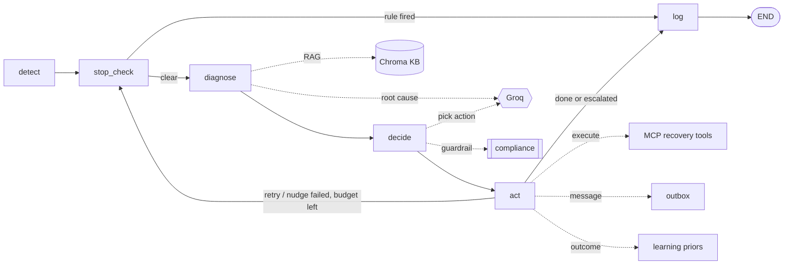

# Revenue Recovery Ops Center

Razorpay AI Buildathon — Track 3: AI Revenue Recovery

> Find revenue that's slipping away and win it back.

A live operations centre for recovering failed revenue. A payment stream simulator
continuously produces attempts; some fail — a declined card, an abandoned checkout, a
lapsed subscription mandate, an overdue B2B invoice. An autonomous agent picks each failure
up, works out how much is recoverable, diagnoses the root cause, chooses the right
intervention within compliance limits, acts on it, messages the customer (email / SMS /
WhatsApp, English or Hinglish), tracks promises-to-pay, and writes the outcome back to a
CSV. A React dashboard shows it all happening, with an agent-vs-baseline scoreboard scored
net of intervention cost — because recovering ₹100 by spending ₹40 on retries is a ₹60 win,
not a ₹100 one.

```
python -m scripts.demo        # 2-second reproducible proof, no LLM, no server
```

---

## Contents

- [What it does](#what-it-does)
- [Feature list](#feature-list)
- [How it meets the Track 3 bar](#how-it-meets-the-track-3-bar)
- [Architecture](#architecture)
- [The agent loop](#the-agent-loop)
- [Setup](#setup)
- [Running it](#running-it)
- [Measured results](#measured-results)
- [Data dictionary](#data-dictionary)
- [Configuration](#configuration)
- [Project layout](#project-layout)
- [Tests and CI](#tests-and-ci)
- [Known limitations](#known-limitations)
- [Tech stack](#tech-stack)

---

## What it does

For every at-risk transaction the agent runs a bounded, auditable loop:

| Stage | What happens |
|---|---|
| Detect | Score the transaction — how much money is realistically recoverable, how urgent, and why it was flagged. The queue is worked highest-value-first. |
| Stop-check | Apply compliance and business rules before acting — do-not-contact, RBI e-mandate retry caps, anti-harassment nudge caps. Halt if any fire. |
| Diagnose | Retrieve the matching failure playbook from a vector knowledge base (RAG) and ask the LLM for the root cause. Or use the KB directly in `AGENT_MODE=playbook` — no LLM. |
| Decide | Pick exactly one intervention from a fixed allow-list. Invalid or hallucinated choices fail safe to human escalation. A compliance guard can still override the choice (e.g. force an overdue invoice to collections). |
| Act | Execute the intervention (simulated Razorpay tools, optionally over MCP), send the customer message via the outbox, record the cost, feed the outcome to the online learning loop. |
| Log | Append a timestamped audit entry — every attempt, not just the last. |

Interventions: `retry`, `send_reminder`, `apply_discount`, `escalate_human`,
`request_mandate_renewal`.

Bounded follow-up: a failed `retry` loops back to the compliance cap; a failed reminder,
discount or renewal gets one more touch (KB "max 2 nudges"); a failed escalation is
terminal — a person owns it.

---

## Feature list

### Recovery agent

- 6-stage LangGraph agent — Detect, Stop-check, Diagnose, Decide, Act, Log, with conditional
  edges and a bounded retry / follow-up loop
- Revenue-at-risk detection — a weighted risk score (money at stake, recoverability,
  urgency, invoice age, customer tier) with a human-readable "why flagged"; the queue is
  processed highest-expected-recovery first
- RAG diagnosis — ChromaDB with `all-MiniLM-L6-v2` over a 9-entry failure playbook of
  per-code causes, resolutions and compliance notes
- LLM decision — `openai/gpt-oss-120b` via Groq, structured-JSON output validated against an
  allow-list, with retry, exponential backoff and a safe fallback
- Playbook mode (`AGENT_MODE=playbook`) — runs the entire pipeline with no LLM: fast,
  offline, deterministic

### Compliance, as a first-class concern

- RBI e-mandate retry caps — max 3 auto-debit retries, tighter (2) for card declines
- Do-not-contact — hard stop, logged
- Anti-harassment nudge cap — max 2 messages on a checkout abandon
- Overdue / high-value invoice escalation — forced to a human past 45 days or for
  high-value accounts
- Every rule firing is recorded in the audit trail with its rule text and shown in the UI

### Impact measurement

- Net-of-cost accounting — every action has a modelled cost (retry fee, per-channel message
  cost, agent-minutes for escalation, margin given up on a discount). The headline metric is
  net recovered = gross recovered − intervention cost
- Agent vs three non-AI baselines — "retry everything", "always remind", "static KB
  playbook", all run on the same transactions with the same outcome model and compliance
  rules, so the delta isolates the value of the decision step
- Reproducible — seeded outcome model; `scripts/demo.py` prints the numbers in about 2 s

### Live operations

- Payment stream simulator — continuous attempts at a configurable rate, ~17 % fail using
  realistic distributions
- Streaming backend — FastAPI with Server-Sent Events; a background worker pulls the
  priority queue and runs the agent
- Human-in-the-loop queue — escalations pause in a UI queue; approve, override the action,
  or reject
- CSV as the source of truth — the simulator appends, the agent writes status back in
  place; download it any time
- Live agent-vs-baseline scoreboard, recovery funnel, per-transaction audit drill-in

### Multi-channel messaging

- Email, SMS and WhatsApp templates, one per failure code, with English and Hinglish
  variants (Track 3 lists "Hinglish voice recovery")
- Channel selection by failure stage — email for invoices, WhatsApp for checkout, SMS for
  subscriptions — consistent with the cost model
- Simulated outbox — messages are rendered, costed and logged to `data/notifications.csv`;
  nothing leaves the machine unless `NOTIFY_REAL=1` and `SMTP_*` are set (email only)

### Promise-to-pay

- Overdue invoices get a PTP date tiered by how overdue they already are; a later check
  marks it kept or breached; a breach escalates

### Online learning loop

- The agent records the real outcome of every (failure_code, action) pair and keeps a
  rolling Beta-smoothed success rate; once a pair has enough observations that rate is
  blended back into the decision model, so the agent's estimate of what works improves over
  a run — and the UI shows the priors moving

### Real MCP

- The 5 recovery actions are exposed as genuine Model Context Protocol tools over stdio
  (`mcp_server/server.py`); `USE_MCP=1` routes the Act stage through the MCP server via a
  sync client

### Dashboard (React)

- Dark glassmorphism theme, animated gradient background, `framer-motion` transitions,
  `recharts` scoreboard
- Panels: live transaction feed, agent activity timeline, 6 live metric tiles, recovery
  funnel, learning panel, human-in-the-loop queue, notification center with EN/Hinglish
  preview, and a sortable/filterable CSV data explorer with per-row audit drill-in and
  download

### Engineering

- 72 tests (unit plus a live API suite driven in playbook mode) and GitHub Actions CI
  (tests, a reproducible-demo smoke check, and the frontend build)
- Dataset generator with documented, seeded distributions and a data dictionary
- Graceful degradation throughout — LLM outage, bad CSV rows, missing MCP server, Windows
  console encoding, one bad transaction

---

## How it meets the Track 3 bar

> Don't just identify the problem. Show measured money recovered across a batch, with
> compliant escalation, stopping rules, and an audit trail.

| Requirement | Where |
|---|---|
| Measured money recovered across a batch | `metrics/engine.py` — net recovered (gross − cost), recovery rate, by stage / by decision; live scoreboard, `scripts/demo.py`, `run_batch.py` |
| Compliant escalation | `graph/compliance.py` — overdue / high-value invoices forced to `escalate_human`; `decide_node` fail-safe; the human-in-the-loop queue |
| Stopping rules | `graph/compliance.pre_action_halt` — do-not-contact, code-aware RBI retry caps, anti-harassment nudge caps; every halt logged |
| Audit trail | `audit_log` in the graph state — per-attempt, compliance-halt and final-summary entries with timestamps; the live CSV; the Download CSV button in the dashboard |
| Plus | net-of-cost impact, human-in-the-loop, multi-channel + Hinglish, promise-to-pay, online learning loop, real MCP tools |

Coverage across all four example directions: payment-degradation root cause to recovery,
checkout drop-off recovery, failed-subscription (mandate) recovery, and B2B receivables
chasing with promise-to-pay.

---

## Architecture

```
 simulator/engine.py ──► data/live_transactions.csv ◄── api/worker.py  (LangGraph agent)
   payment stream            source of truth              detect → diagnose → decide → act → log
        │                          │                              │
        │ events                   │                    notifications/outbox.py
        ▼                          ▼                    (email / SMS / WhatsApp, EN / Hinglish
              api/events.py  (in-process bus)            → data/notifications.csv)
                          │                                       │
                          ▼                              learning/priors.py  (online loop)
              api/main.py  —  FastAPI  +  SSE  /stream
       REST snapshots · human-in-the-loop queue · CSV export
                          │
                          ▼
   frontend/  —  Vite + React + TS  (dark glassmorphism, framer-motion, Recharts)
   live feed · agent timeline · net-of-cost scoreboard · funnel · learning panel ·
   approval queue · notification center · CSV data explorer
```

| Layer | Module |
|---|---|
| Orchestration | LangGraph `StateGraph` — `graph/build_graph.py`, shared `graph/state.py` |
| Detection | `graph/detection.py` — risk score, expected-recoverable ₹, queue priority |
| Compliance | `graph/compliance.py` — halts and guardrail overrides |
| Diagnosis | `graph/nodes.py` with `rag/` (Chroma + MiniLM), or `graph/playbook.py` (no LLM) |
| Decision LLM | `llm/client.py` — Groq `openai/gpt-oss-120b`, retry and fallback |
| Recovery tools | `mcp_tools/tools.py` (feature-aware seeded outcomes) and `mcp_tools/costs.py` |
| MCP server | `mcp_server/server.py` and `mcp_tools/client.py` |
| Messaging | `notifications/outbox.py`, `templates.py`, `ptp.py` |
| Learning | `learning/priors.py` |
| Metrics | `metrics/engine.py` — gross and net, strategy comparison |
| Baselines | `baseline/strategy.py` |
| Live backend | `api/main.py`, `worker.py`, `events.py` |
| Frontend | `frontend/` |
| Data | `data/generate_dataset.py`, `loader.py`, `live_store.py` |

---

## The agent loop



---

## Setup

Requires Python 3.11+, Node 18+, and — for LLM mode only — a free
[Groq API key](https://console.groq.com/keys).

```bash
git clone <this-repo> && cd RazorPay

python -m venv venv
venv\Scripts\activate                 # Windows   (source venv/bin/activate elsewhere)
pip install -r requirements.txt

cp .env.example .env                   # then set GROQ_API_KEY=...   (skip for playbook mode)
python rag/build_index.py              # build the RAG vector store (LLM mode only)

cd frontend && npm install && cd ..
```

`AGENT_MODE=playbook` needs neither the Groq key nor the RAG index — it is the zero-config
path (`python -m scripts.demo` works right after `pip install`). LLM mode needs both.

---

## Running it

### 1. One-command demo (no LLM, no server, ~2 s)

```bash
python -m scripts.demo                 # committed 400-row dataset, agent vs baselines
python -m scripts.demo --gen 500       # regenerate a fresh N-row set first
```

### 2. The live Ops Center

```bash
# terminal 1 — backend   (AGENT_MODE=playbook = fully offline; omit it to use Groq)
AGENT_MODE=playbook uvicorn api.main:app --reload

# terminal 2 — frontend
cd frontend && npm run dev             # → http://localhost:5173
```

In the dashboard: pick a rate, then Start simulation. Payments fail and stream into the
feed; the agent works each one (the timeline shows every step); messages appear in the
notification center; escalations land in the approval queue to approve, override or reject;
the scoreboard tracks net recovered vs the baselines; Download CSV exports the live data.

### 3. Headless batch (reproducible metrics to `results/`)

```bash
python run_batch.py 100
DATASET=data/failed_transactions.csv python run_batch.py    # the 500-row set
```

### 4. MCP server

```bash
python -m scripts.mcp_demo             # start the server, list its tools, call them
USE_MCP=1 python run_batch.py 50       # route the Act stage through MCP
```

### 5. Tests

```bash
pip install -r requirements-dev.txt
python -m pytest
```

`make demo | test | backend | frontend | mcp | dataset` wraps the common commands.

---

## Measured results

Priority-ordered batch, seeded outcome model, scored net of intervention cost. "AI agent"
here is the agent's decision rule with the LLM replaced by the knowledge-base playbook — in
a partial live run (161 transactions, before the Groq free-tier daily token cap) the LLM's
decisions tracked this policy closely, with compliance overrides pushing high-value overdue
invoices to human escalation.

| dataset | strategy | gross recovered | cost | net recovered | net rate |
|---|---|--:|--:|--:|--:|
| v2 (400) | AI agent | ₹2,748,392 | ₹14,764 | ₹2,733,628 | 65.1 % |
| | retry everything | ₹832,093 | ₹2,433 | ₹829,660 | 19.8 % |
| | always remind | ₹1,545,574 | ₹160 | ₹1,545,415 | 36.8 % |
| legacy (500) | AI agent | ₹3,128,326 | ₹30,283 | ₹3,098,043 | 69.8 % |
| | retry everything | ₹1,325,723 | ₹3,243 | ₹1,322,480 | 29.8 % |
| | always remind | ₹2,509,349 | ₹210 | ₹2,509,138 | 56.5 % |

**The agent nets about ₹1.19M more than the best naive baseline on the 400-row set (+28 pp),
and about ₹0.59M more on the 500-row set (+13 pp).** Reproduce with `python -m scripts.demo`.

Stability: across 5 outcome-model seeds the agent's net advantage over the strongest
baseline ("always remind") is +7 to +33 pp on the 400-row set and +8 to +20 pp on the
500-row set; "retry everything" always loses badly (~20–30 % net rate). It can go slightly
negative on very small samples (~200 rows) because a handful of whale invoices swing the
total — that is sample noise, not a property of the strategy.

An honest note on the numbers: these are the KB policy running through the full pipeline.
Because the LLM's decisions tracked that policy closely in the partial live run, the LLM's
edge over a hand-tuned playbook on raw net-recovered is currently small. The AI's value-add
is elsewhere — it explains every decision in plain language, its compliance layer catches
playbook mistakes, it generalises to unseen failure codes, and it drives channel selection,
promise-to-pay and Hinglish messaging. Making the LLM cost-aware, so it picks the
net-optimal action rather than just the KB one, is the next lever.

---

## Data dictionary

`data/transactions_v2.csv` — 400 synthetic at-risk transactions from
`data/generate_dataset.py` (seeded; a legacy 500-row `data/failed_transactions.csv` is also
kept). Regenerate with `python data/generate_dataset.py [N]`.

| column | type | notes |
|---|---|---|
| `txn_id` | str | unique |
| `user_id` | str | ~140 distinct users |
| `amount` | float ₹ | log-normal; median ≈ ₹1.7k regular / ₹9k high-value; invoices much larger |
| `payment_method` | enum | `upi`, `card`, `netbanking`, `mandate` |
| `failure_code` | enum | 9 codes (below) |
| `failure_stage` | enum | derived from `failure_code` |
| `retry_count` | int | 0 (85 %) / 1 (11 %) / 2 (4 %); always 0 for `card_expired`, `mandate_lapsed` |
| `timestamp` | ISO | within the last 14 days |
| `do_not_contact` | bool | ~6 % |
| `customer_segment` | enum | `regular` (82 %) / `high_value` (18 %) |
| `preferred_language` | enum | `hinglish` (60 %) / `en` (40 %) |
| `days_overdue` | float | `invoice_unpaid` only (mean ≈ 32, cap 120); empty otherwise |

failure_code to failure_stage:

- `insufficient_funds`, `bank_decline`, `card_expired`, `issuer_timeout` → `payment_failure`
- `gateway_timeout`, `otp_timeout`, `user_dropped` → `checkout_abandon`
- `mandate_lapsed` → `subscription_failure`
- `invoice_unpaid` → `receivable_overdue`

Frequency mix (indicative real-world, not tuned to favour the agent): `insufficient_funds`
22 %, `invoice_unpaid` 16 %, `bank_decline` 12 %, `issuer_timeout` 10 %, `card_expired` 9 %,
`otp_timeout` 8 %, `mandate_lapsed` 8 %, `user_dropped` 8 %, `gateway_timeout` 7 %.

Success probabilities (`mcp_tools/tools.py`) and costs (`mcp_tools/costs.py`) are
hand-calibrated to be plausible, each with a one-line rationale — not fitted to real data.

---

## Configuration

All optional; sane defaults everywhere.

| env var | default | effect |
|---|---|---|
| `GROQ_API_KEY` | — | required for LLM mode (`.env`) |
| `AGENT_MODE` | `llm` | `playbook` skips the LLM entirely (offline, deterministic) |
| `RECOVERY_SEED` | `42` | seed for the outcome model — change for a different reproducible run |
| `USE_MCP` | off | `1` routes the Act stage through the MCP server |
| `LEARNING` | `1` | the online learning loop; `0` disables the blend |
| `DATASET` | `data/transactions_v2.csv` | dataset for `run_batch.py` and the legacy UI |
| `LIVE_CSV`, `NOTIF_CSV` | `data/live_*.csv` | live-store paths |
| `NOTIFY_REAL` with `SMTP_HOST/USER/PASS/PORT` and `NOTIFY_TO` | off | actually send recovery emails |

---

## Project layout

```
RazorPay/
├── scripts/demo.py              1-command reproducible agent-vs-baseline demo
├── run_batch.py                 headless batch runner (net-of-cost metrics)
├── Makefile                     make demo | test | backend | frontend | mcp | dataset
├── api/
│   ├── main.py                  FastAPI — REST + SSE + CSV export
│   ├── worker.py                simulator loop + agent worker + human-in-the-loop queue
│   └── events.py                in-process pub/sub for the SSE stream
├── simulator/engine.py          payment stream simulator
├── frontend/                    Vite + React + TS dashboard (dark glassmorphism)
│   └── src/  api.ts · components.tsx · App.tsx · styles.css
├── graph/
│   ├── build_graph.py           wires and compiles the StateGraph
│   ├── nodes.py                 the 6 nodes + routing (+ playbook mode)
│   ├── state.py                 RecoveryState
│   ├── detection.py             risk scoring + queue prioritisation
│   ├── compliance.py            RBI / do-not-contact / nudge-cap rules
│   └── playbook.py              KB action per failure code
├── mcp_tools/  tools.py (outcomes) · costs.py (cost model) · client.py (MCP client)
├── mcp_server/server.py         recovery actions as MCP tools (stdio)
├── notifications/  outbox.py · templates.py (EN + Hinglish) · ptp.py (promise-to-pay)
├── learning/priors.py           online (failure_code → action) success loop
├── baseline/strategy.py         non-AI baselines
├── metrics/engine.py            gross + net metrics, strategy comparison
├── llm/client.py                Groq client with retry + fallback
├── data/  generate_dataset.py · loader.py · live_store.py · *.csv
├── rag/  knowledge_base.json · build_index.py · retriever.py  (chroma_db/ is generated)
├── tests/                       72 tests
├── legacy/app.py                the old Streamlit UI (superseded by frontend/)
└── .github/workflows/ci.yml
```

---

## Tests and CI

```bash
python -m pytest            # 72 tests, ~15 s
```

The suite covers the deterministic core (outcome model, cost model, detection, compliance,
routing, metrics, baselines, CSV loader, dataset generator, simulator, outbox and PTP,
LiveStore, learning priors, playbook agent) and the live FastAPI backend end to end (in
playbook mode). GitHub Actions runs the suite, the reproducible-demo smoke test, and the
frontend build on every push.

---

## Known limitations

- It is a simulation. No live Razorpay connection, no real money, no real emails. The MCP
  tools model each outcome as `P(success | failure_code, action, features)`; the outbox is a
  simulated send (real SMTP is behind `NOTIFY_REAL=1`). Swapping in real Razorpay APIs
  touches only `mcp_server/server.py`.
- Success probabilities and costs are hand-calibrated to be plausible, not fitted to data.
- Synthetic dataset; hand-written 9-entry knowledge base.
- The LLM's edge over the KB playbook on raw net-recovered is currently small — the next
  step is a cost-aware decision prompt (needs Groq quota to validate).
- Single-transaction processing (no cross-transaction batching of comms).
- The Groq free tier caps daily tokens; `AGENT_MODE=playbook` runs everything offline.

---

## Tech stack

- Agent — LangGraph, LangChain-Core, Groq (`openai/gpt-oss-120b`), ChromaDB,
  sentence-transformers (`all-MiniLM-L6-v2`), Model Context Protocol SDK
- Backend — FastAPI, Uvicorn, SSE-Starlette, pandas
- Frontend — Vite, React 18, TypeScript, framer-motion, Recharts
- Tooling — pytest, GitHub Actions

---

Built for the Razorpay AI Buildathon, Track 3.
